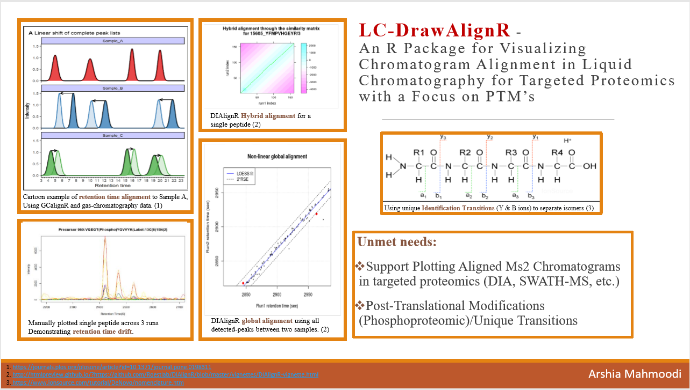
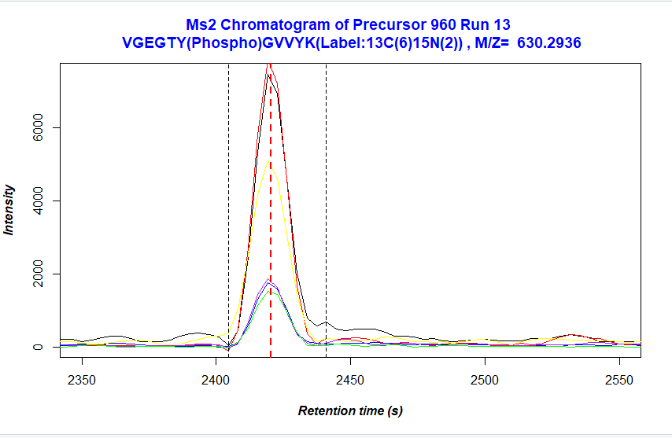
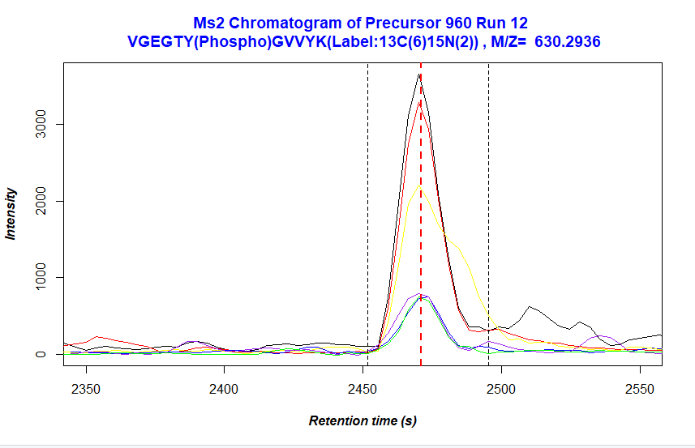
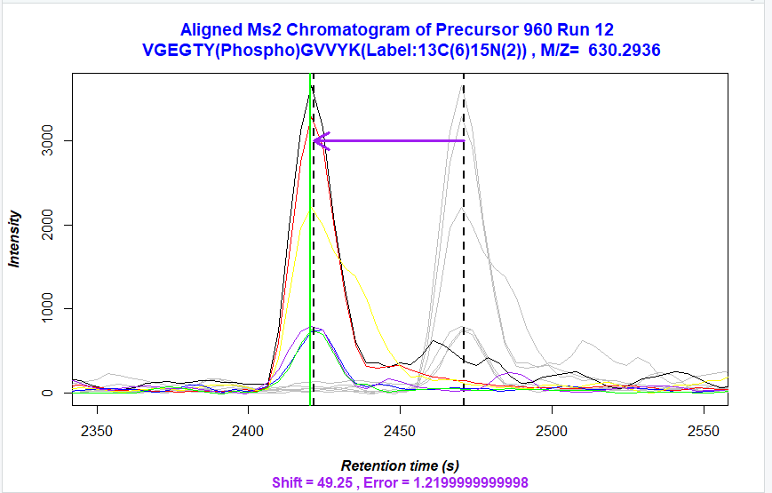

# DrawAlignR

An R package for the visualization of aligned ms2 chromatograms.

## Installation

To install this package, follow these commands:

``` r
require("devtools")
install_github("ArshiaMahmoodi/DrawAlignR")
library(DrawAlignR)
```

## Overview

Illustration of general overview:



## Usage and Example

Visualization is intended to occur downstream of an alignment tool, using two peptide chromatograms and shift value
(as obtained from alignment algorithm) as input.

The user may first elect to simply visualize any peptide in the data set, without alignment to serve as a point of
reference. This can be done using the following function:

``` r
plot_chrom_reference(chrom, precursor, Run_ID, RT, Left_width, Right_width, mz, sequence)
```

Providing the run and peptide information for the example data for precursor 960, in run 13:

``` r
library(DrawAlignR)
plot_chrom_reference(chrom13_GR.mzML_ChromSelected, 960, 13, 2420.42, 2404.61, 2440.96, 630.2936, "VGEGTY(Phospho)GVVYK(Label:13C(6)15N(2))")
```



Providing the run and peptide information for the example data for precursor 960, in run 12:


``` r
plot_chrom_reference(chrom12_GR.mzML_ChromSelected, 960, 12, 2470.89, 2451.82, 2495.44, 630.2936, "VGEGTY(Phospho)GVVYK(Label:13C(6)15N(2))")
```




Afterwards, the user can visualize the aligned chromatogram to the reference run. Here, run 13 was the reference
and run 12 was aligned. The shift value was calculated upstream using DiaLignR and is not shown.


plot_aligned(chrom12_GR.mzML_ChromSelected, 49.25, 960, 12, 13, 2470.89, 2420.42,2451.82, 2495.44, 630.2936, "VGEGTY(Phospho)GVVYK(Label:13C(6)15N(2))")




## Contributions

The author of this package is Arshia Mahmoodi. The following functions are intended for the user:

``` r
plot_chrom_reference
plot_aligned
```

All functions were written by Arshia Mahmoodi.

The upstream alignment was run with the help of Justin Sing and Shubham Gupta, and Hannes Rost, members of the Rost lab,
using the DialignR package, which can be found at:

``` r
install_github("Roestlab/DIAlignR")
```
