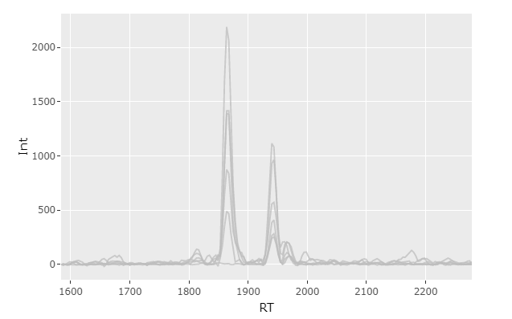
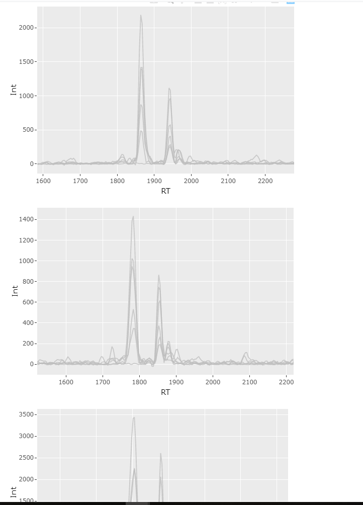
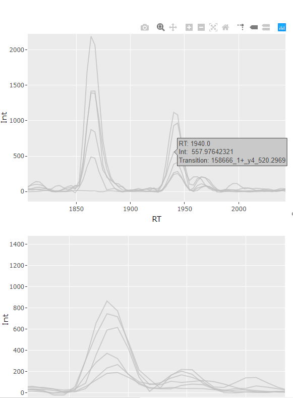
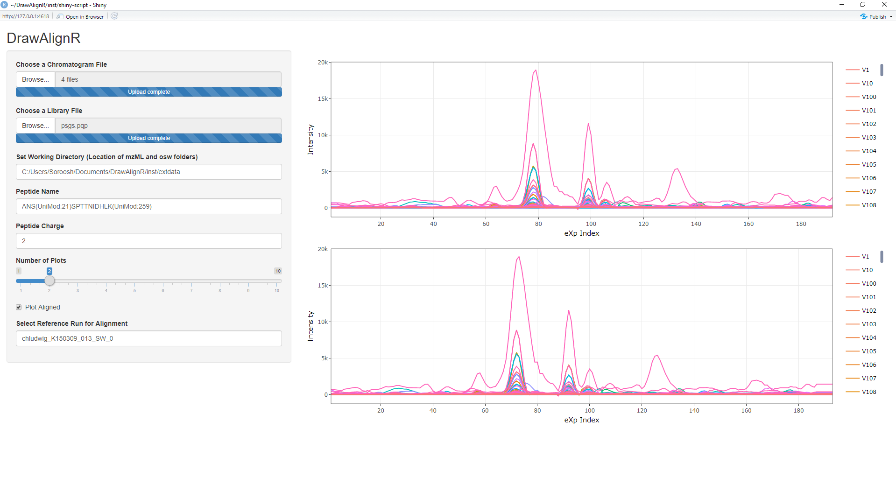
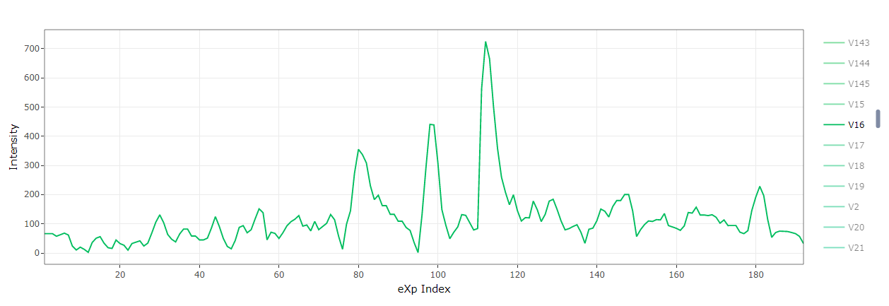
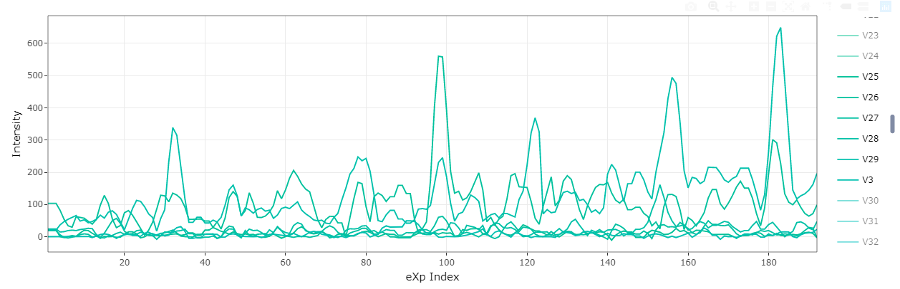

# DrawAlignR

An R package for the visualization of aligned ms2 chromatograms.

## Installation

To install this package, follow these commands:

``` r
require("devtools")
install_github("ArshiaMahmoodi/DrawAlignR")
library(DrawAlignR)
```

## Overview

Illustration of general overview:


## Usage and Example

Visualization is intended to occurs downstream of an alignment tool, using 1 or more peptide chromatograms and the R package DIAlignR
for alignment.

The user may first elect to simply visualize any peptide in the data set, without alignment to serve as a point of
reference. This can be done via the shiny web app by setting the following parameters:

Selecting 1 or more mzML files, e.g. chludwig_K150309_013_SW_0.chrom.mzML

Selecting the library file , e.g psgs.pqp

Full Peptide name, e.g ANS(UniMod:21)SPTTNIDHLK(UniMod:259)

Peptide Charge:  e.g 2

This will then plot the chromatogram for this peptide in the selected runs.



If more than one chromatogram is supplied, multiple plots will be generated.



Additionally, the plot is interactive and hovering over a point gives intensity, rt and id information




Afterwards, the user can visualize the aligned chromatogram to the reference run. Here, run 13 was the reference
and run 12 was aligned. Please see the vignette to see how to prepare and organize the files for alignment. In addition to the above,
an sql database file ".osw" is required.

Afterwards, checking the 'Plot Aligned' box



Additionally, individual transitions can be selected/de selected from a particular aligned chromatogram to observe them.





## Contributions

The author of this package is Arshia Mahmoodi. The following functions are intended for the user:

``` r
runDrawAlignRShiny.R
```

The author of this package is Arshia Mahmoodi.

R scripts plot_aligned, plot_chrom_reference.R, runDrawAlignRShiny.R and app.R were authored by Arshia Mahmoodi.

R scripts getChromatogramDataPoints.R, getPepLibData.R and getXIC.R were authored by Justin Sing, in the Roest Lab.

R package DIAlignR was used to compute the alignment used by this package, the author of DIAlignR is Shubham Gupta, in the Roest Lab.

``` r
install_github("Roestlab/DIAlignR")
```
